# All-rate Reed-Solomon capacity formalization

Status: active planning and integration tracker  
Last updated: 2026-09-04  
Integration branch: `quang/all-rate-rs-capacity-formalization`  
Fork: <https://github.com/quangvdao/ArkLib>  
ArkLib base: `Verified-zkEVM/ArkLib@22dbd4e836c15a21f68889afa69b7130da04abbb`
Normative paper: `quangvdao/all-rate-rs-list-decoding@9e4d6488ead94be47cca69e5be915b5667143b66`

This document is the single source of truth for formalizing the all-rate hidden-derivative Reed-Solomon list-decoding theorem. It is deliberately kept on the integration branch with the proof. It records the theorem contract, provenance, dependencies, ownership boundaries, risks, and completion gates for a long-running multi-contributor effort.

The fork and this branch are public because GitHub forks of the public ArkLib repository are public. No result should be described as verified or announced from this branch until the gold completion gate below passes.

## 1. Mission and non-negotiable scope

The target is an axiom-clean Lean proof that hidden-derivative interpolation list decodes Reed-Solomon codes at every rate up to every fixed positive gap from capacity. The derivative order must depend only on the gap, not on the rate, block length, evaluation set, or received word.

The project may first prove weaker constants or a worse list-size exponent. It may not weaken any of the following qualitative conclusions:

- all code rates are covered;
- every fixed capacity gap `δ > 0` is covered;
- one derivative order `d(δ)` works uniformly over all rates;
- the evaluation points are arbitrary and distinct;
- the main theorem applies over prime fields with `q ≥ n`;
- the output list is characterized exactly, rather than merely soundly;
- the list bound has the form `C(δ) q^e(δ)`, with exponent and prefactor independent of `n` once `δ` is fixed;
- the proof exposes the characteristic hypotheses used by differential root finding.

The initial capstone may use an existential or very large explicit `d(δ)` and the older `q^(4d+6)`-type bound. The optimized derivative order, the `q^(2d)` bound, the order-zero regime for `δ ≥ 1/4`, the optional fixed-parameter order-one certificate at gap `1/4`, and shrinking-gap results are refinement milestones, not excuses to delay the qualitative all-rate theorem.

## 2. Target theorem contracts

The qualitative Lean signatures are frozen in task `S0`; paper-dependent quantitative signatures
are synchronized in `S0.1`. The following mathematical statements are normative.

### 2.1 Combinatorial capstone

For every real `δ` with `0 < δ < 1`, there exist natural numbers `d = d(δ)`, `N = N(δ)`, and a list-bound exponent or constant depending only on `δ` such that the following holds.

For every `n ≥ N`, every `1 ≤ k ≤ n`, every prime `q ≥ n`, every injection

```text
α : Fin n ↪ ZMod q,
```

and every received word `y : Fin n → ZMod q`, define

```text
A = k + ceil(δ n).
```

If `A > n`, the requested list is empty. Otherwise, the set of polynomials `P` with `degree P < k` and at least `A` agreements with `y` has cardinality bounded by a function of `q` and `δ` that is independent of `n`, `k`, `α`, and `y`. The first accepted form may use `q^(4d+6)` or another rigorously derived constant exponent. The refined form should prove `O_δ(q^(2d))`, improving to `O_δ(q^d)` under the paper's larger-field condition.

The theorem must also be connected to ArkLib's canonical `ReedSolomon.code`, `Code.agree`, `Code.closeCodewordsRel`, and `Code.Lambda` definitions. A corollary should state the corresponding radius `1 - k/n - δ`, with all floor and ceiling conversions proved rather than left implicit.

### 2.2 Algorithmic capstone

There is a decoder that returns exactly the degree-`< k` polynomials meeting the agreement threshold. Soundness, completeness, duplicate-freedom or set semantics, and the list-size bound must be proved.

The first combinatorial capstone need not claim runtime. A runtime theorem is accepted only after its algorithm and cost model are represented faithfully in Lean. Informal extraction from noncomputable existence is not an algorithmic theorem.

### 2.3 Uniformity test

The final quantifier order must make rate independence syntactically visible:

```text
∀ δ, 0 < δ → δ < 1 →
  ∃ d N B, ∀ n k q α y, ...
```

In particular, `d` must be chosen before `n`, `k`, the rate, `q`, `α`, and `y`. Any theorem with `d` chosen after `k/n` is not the target theorem.

### 2.4 Characteristic boundary

The local Hasse-Taylor identities are characteristic-safe. The nonsingular-jet lifting argument is not. Its hypotheses must explicitly imply:

- the ambient polynomial degree `D` is less than the characteristic;
- every relevant individual `Y_j`-degree is less than the characteristic;
- the chosen base or extension field has enough points to find a nonsingular witness.

For the prime-field capstone, these obligations must be discharged from `q ≥ n`, the ambient choice, and the eventual block-length threshold. A cardinality-only finite-field generalization must not silently conceal bounded-characteristic failure.

The preferred generic root-counting contract is division-free. If `S` is the witness-field size, `H` bounds the bad witness points, `Δ` bounds the relevant individual degree, and `Roots_D(Q)` is the set of degree-`≤D` solutions, prove a natural-number inequality of the form

```text
(S - H) * card (Roots_D Q) ≤ S * Δ * S^d.
```

The `q^(2d)` and larger-field `q^d` bounds should be corollaries. This avoids field division and keeps the exact finite hypotheses visible.

### 2.5 Strong quantitative capstone

The quantitative contract was temporarily unfrozen while the current paper source was reconciled
with the Lean statements. The source-alignment audit is now pinned to paper commit `9e4d648` and
records the corrected exponential constant, low-order regimes, multiplicity, larger-field
hypothesis, and shrinking-gap threshold below. Contributors must not implement the former `172/25`
or `C > 13.76` statements from an old tracker revision.

```text
dδ = 0                              if δ ≥ 1/4,
dδ = ceil(exp((169/25) / δ))        if 0 < δ < 1/4.
```

The rational constant `169/25` is the exact formal representation of `6.76`. Decimal approximation must not enter a proof term. For `0 < δ < 1/4`, take `m = ceil(100 d² H_(d-1))` and `N = 8m`; the list bound is `B(δ) q^(2d)`, improving to `B(δ) q^d` under the paper's separant-based larger-field condition. For `1/4 ≤ δ < 1/2`, the order-zero proof gives list size `< 4q`, not a gap-dependent constant; for `δ ≥ 1/2`, the list size is at most one. The optional `d = 1`, `m = 64`, `M = 16` certificate applies at gap `1/4` but is not the headline derivative order. The shrinking-gap corollary is `δ_n = C / log n` for `C > 13.52`.

The strong contract is therefore split into an order-zero statement and a small-gap asymmetric-band statement. Derivative order and field-size exponent must never again be identified in a single formula across the `δ = 1/4` boundary, and the order-zero interpolation multiplicity must not be quantified as a function of `δ` alone.

This repinning releases `S0.1` and its quantitative descendants for implementation. It does not
replace the independent theorem and source-correspondence audit required by `A0` before publication
or announcement.

## 3. Gold trust and announcement gate

The project is complete only when all of the following hold on the integration branch:

- the combinatorial capstone has no project axioms and no `sorry`, `admit`, `unsafe`, or native-code trust escape;
- the differential root-counting theorem used by the capstone is proved in ArkLib, not imported as an axiom;
- the algorithmic capstone, if announced, has a proved exact decoder and an honest cost model;
- `#print axioms` for every advertised capstone reports only ArkLib's accepted logical baseline, normally `propext`, `Classical.choice`, and `Quot.sound`;
- `./scripts/validate.sh --axioms` passes;
- the theorem statement has undergone an independent adversarial audit against the paper and against edge cases;
- a clean clone of the fork branch builds and reproduces the axiom audit;
- every adapted source is credited at file level and in the blueprint bibliography.

A theorem temporarily parameterized by the Kopparty root-finding result may be useful as scaffolding, but it is not a completed verification and must be named and documented as conditional. It must not be the theorem used for an announcement.

## 4. Sources, provenance, and credit

### 4.1 Mathematical sources

- Joshua Brakensiek, Yeyuan Chen, Aaron Putterman, Zihan Zhang, and Kai Zhe Zheng, *Algorithmic List Decoding of Reed-Solomon Codes up to Capacity in the Low-Rate Regime*, ECCC TR26-164. This is the source of the hidden-derivative interpolation framework and the published low-rate specialization.
- Swastik Kopparty's differential-equation root-finding theorem, as cited by the ECCC report. This result must be reconstructed in Lean for the gold capstone.
- Quang Dao, Scott Duke Kominers, Justin Thaler, and Kai Zhe Zheng, *Reed--Solomon List Decoding up to Capacity at Every Rate*, source snapshot `9e4d6488ead94be47cca69e5be915b5667143b66` in the private research repository. This is the normative source for the stronger theorem, adaptive ambient-padding argument, improved interpolation analysis, sharper list bound, refinements, and limitations. Scott Duke Kominers supplied the latest GPT-6 Astra/Claude Fable 5.1 audit incorporated in this snapshot.

Bibliographic entries `BCPZZ26` and `DKTZ26`, together with durable knowledge-base source records,
are part of the paper-alignment checkpoint. Theorem-to-source links must be kept current as modules land.

### 4.2 Prior Lean formalization

Kai Zhe Zheng's repository <https://github.com/kz99/rs-ld-mca>, pinned at commit `82c1d5c00820f74a7ec18be716c033430bef5ae8`, is an approved source of formalization material. Its substantive formalization commit is `be57cd2`. Adapted material must credit Kai Zhe Zheng, preserve the source commit, and state that it is used with permission. The durable project-owner attestation, exact source revisions, current adaptation map, and unresolved evidence fields are recorded in [`docs/kb/sources/rs-ld-mca/PERMISSION.md`](docs/kb/sources/rs-ld-mca/PERMISSION.md).

The pinned repository currently:

- builds with warnings treated as errors;
- passes `lean --trust=0` on its main module;
- contains no `sorry`, `admit`, or `unsafe` declarations;
- formalizes the repaired low-rate theorem, including ambient subcode padding;
- contains 8,507 lines across roughly 43 Lean modules;
- assumes two project axioms for the cardinality and algorithmic clauses of Kopparty's differential-equation solver.

It therefore provides a valuable proof certificate for much of the interpolation pipeline, but not a fully verified root solver and, at the initially audited snapshot, not the uniform additive-gap parameter theorem. Its custom message, list, and code interfaces must be bridged to ArkLib's canonical APIs rather than copied as a second public Reed-Solomon frontend.

Its advertised algorithmic theorem also does not yet certify executable computation. `FieldCost α` is only a transparent pair of an arbitrary result and a claimed natural-number charge. In particular, `FieldCost.pure (decodingList ...)` can package the declarative answer at zero cost. The current top-level existence statement therefore cannot distinguish a genuine decoder from an oracle-like definition, even before accounting for the assumed Kopparty algorithm. We may reuse its finite linear-algebra implementation and mathematical filtering lemmas, but `R7`, `D0-D3`, and any runtime theorem need a stricter executable and compositional interface.

During this audit, canonical `kz99/rs-ld-mca` main advanced to `9699ee7a6143f6efe1d8cfed84998a4f8c79c40f`. The new `FreeParameters.lean`, `FreeRankThreshold.lean`, and `MainAllRate.lean` layer proves a free-derivative-order theorem for each fixed agreement `ε` and multiplicative slack `θ`. This is useful staging but is not yet the target uniform-gap theorem: its `d₀` is chosen from `(ε, θ)`, whereas our capstone must choose one `d(δ)` before seeing any rate. It also retains both Kopparty axioms and the weak `FieldCost` interface. The original development is by Kai Zhe Zheng. The free-order extension came through PR 1 from Pratyush Mishra; its code commit `b1e346f...` records `Codex <codex@openai.com>` as author and Pratyush Mishra as committer, and Kai Zheng merged it at `9699ee7...`. Preserve this provenance in adapted files.

The new head has now passed a separate clean audit at its own pins: `lake build --wfail`, the repository trust script, and `lean --trust=0` with warnings as errors on both the main module and axiom-audit module. No proof hole was found beyond the same two explicit Kopparty axioms. The original `82c1d5c...` snapshot remains recorded because it was the exact version first audited; new reuse work should pin `9699ee7...` or a later explicitly audited head.

The source repository has no visible license file at the pinned commits. The permission record now durably preserves Quang Dao's attestation that one of the source formalization's authors approved reuse for this formalization. It does not yet archive the direct grant, identify its grantor, or establish Apache-2.0 compatibility. Do not claim a blanket public license or license compatibility until direct evidence with adequate scope is added to that record.

### 4.3 Existing ArkLib work

The following unmerged branches have been audited as potential inputs:

| Source | Pinned head | Disposition |
|---|---|---|
| PR 857, weighted multivariate support | `f37f25ba` | Rebase or cherry-pick as a clean foundation after review. No `sorry`. |
| PR 856, Hasse-Taylor infrastructure | `0c6d0a40` | Rebase or cherry-pick as a clean foundation after review. No `sorry`. |
| PR 855, list-decoding specification | `c7e9e01e` | Extract the generic contracts and prove the two filtering holes immediately. Do not import its stale low-rate capstone as verified. |
| Hidden-variable/substitution stack | `067acdff` | Port only the algebraic commits or files. Do not import the merge stack wholesale because it inherits PR 855's holes. |

The useful hidden-variable commits are `1b827589`, `71214c68`, and `d3370654`. Avoid the stack merge commits `3feac154` and `07cf41c1`.

### 4.4 Reuse estimate

The prior formalization and existing ArkLib branches substantially shorten the algebraic critical path. They cover most definitions and proof patterns for Hasse derivatives, hidden substitutions, local constraints, finite interpolation, Gaussian kernel extraction, filtering, and the repaired low-rate theorem. They do not remove the two hardest obligations:

1. formalizing differential-equation root counting and root enumeration without axioms;
2. proving a uniform all-rate parameter certificate with `d` depending only on `δ`.

With the fresh free-order layer and finite-cover wrapper, the practical estimate is that existing work removes 70 to 85 percent of the interpolation and parameter work for the first qualitative theorem, or roughly 45 to 60 percent of its complete axiom-clean critical path after ArkLib adaptation and root counting are included. It removes only about 25 to 35 percent of the explicit `169/(25δ)` path and less than 20 percent of an honestly executable decoder/runtime path. The remaining work contains the deepest independent arguments and most of the cross-library adaptation.

### 4.5 Accelerated qualitative route from the fresh donor theorem

The free-order theorem at donor commit `9699ee7...` can likely be wrapped into the required uniform additive-gap theorem by a finite rate cover. This is now the preferred phase-one parameter route, subject to a complete rounding audit.

Fix `δ`, put `h = δ/2`, and let `J = ceil((1-δ)/h)`. For `1 ≤ j ≤ J`, define `a_j = min(jh, 1-δ)`. The intervals `[a_j-h,a_j]` cover `[0,1-δ]`. For a positive endpoint `a = a_j`, set

```text
ε_a = a + h,
θ_a = h / ε_a = δ / (2a + δ).
```

Then

```text
(1 - θ_a) ε_a = a.
```

For every rate `r` in that interval, `r ≤ a` and `a-r ≤ δ/2`. Hence the actual message dimension lies below the donor ambient dimension, while

```text
ε_a ≤ r + δ.
```

The requested threshold `k + ceil(δn)` is therefore at least the donor threshold `ceil(ε_a n)`, using `ceil(k+x)=k+ceil(x)` for natural `k`. Take the maximum of the finitely many donor order thresholds `d₀(ε_a, θ_a)`.

For the remaining finite side conditions, put `a_min = min(h,1-δ) > 0` and `m=d^3`. It suffices to choose one `N(δ)` large enough that, for every `n ≥ N`,

```text
a_min n ≥ d + 2,
a_min n ≥ 4,
n ≥ m,
n > ceil(2m/a_min).
```

These inequalities uniformly give `d < K_a`, donor agreement threshold at most `n`, `mA_a ≤ n² ≤ q²`, and `B_a < n ≤ q`. This produces one coarse `d(δ)` and `N(δ)` before the code rate is known.

This finite-cover reduction offers the shortest qualitative path because it reuses the donor's already checked free-order rank comparison. It does not yield the paper's sharp `exp((169/25)/δ)` dependence, and it does not remove the Kopparty cardinality axiom by itself. The direct adaptive-padding and asymmetric-band paths remain necessary for the sharp theorem and provide an independent cross-check of the finite-cover proof.

## 5. Architecture and module ownership

New coding-theory modules should live under the following structure unless an implementation review finds a better existing namespace:

```text
ArkLib/Data/CodingTheory/ReedSolomon/
├── ListDecoding/
│   ├── Specification.lean
│   └── AgreementRadius.lean
├── HiddenDerivative/
│   ├── Parameters/
│   │   ├── Basic.lean
│   │   ├── Qualitative.lean
│   │   └── AsymmetricBand.lean
│   ├── Variables.lean
│   ├── Substitution.lean
│   ├── LocalIdentity.lean
│   ├── DifferentialSpecialization.lean
│   ├── InterpolationSpace.lean
│   ├── LocalConstraints.lean
│   ├── LocalRank.lean
│   ├── Counting.lean
│   ├── AsymmetricBandIndex.lean
│   ├── ExactLocalRank.lean
│   ├── Interpolation.lean
│   ├── Multiplicity.lean
│   ├── DifferentialEquation.lean
│   └── RootFinding/
│       ├── RegularLifting.lean
│       ├── SingularRecursion.lean
│       ├── Counting.lean
│       ├── Extension.lean
│       └── Resonance.lean
└── AllRateListDecoding/
    ├── Contracts.lean
    ├── RateCover.lean
    ├── UniformThresholds.lean
    ├── OrderZero.lean
    ├── Characteristic.lean
    ├── Sharpness.lean
    └── Main.lean
```

Generic Hasse-derivative, polynomial-divisibility, weighted-support, and finite-dimensional linear-algebra lemmas belong in existing generic namespaces under `ArkLib/ToMathlib` or `ArkLib/Data`, not in a coding-theory module. Coding-theory files may depend on generic files, never the reverse.

`ArkLib.lean` is generated. Contributors must not edit it by hand. Regenerate it once per integration wave with `./scripts/update-lib.sh` after new files have been staged.

## 6. Saturated dependency graph

Every node below has a narrow owner and an explicit acceptance condition in Section 7. Nodes at the same horizontal level should be assigned concurrently whenever worktrees are available.

### Current execution limit (user override, 2026-09-04)

The dependency graph describes available work, not permission to run every lane simultaneously.
To reduce usage, existing conversations may finish their current bounded objectives, then must
stop. They must not start follow-on objectives or spawn further subagents. After those lanes
drain, the central orchestrator will use at most **three durable worker conversations**, without
automatic nested fan-out. The central orchestrator remains the sole integration owner.

The endpoint is the paper's **Theorem 1.1** at source pin `9e4d648`: deterministic all-rate
decoding with gap-only parameters, the stated derivative orders, and the stated list bounds.
The coarse qualitative combinatorial capstone is an intermediate checkpoint, not completion of
the algorithmic or explicit-parameter claims. Work needed for those claims stays on the path;
independent lower bounds, shrinking gaps, broader characteristic results, and unrelated rank
refinements are deferred. Existing drafts are preserved for later reuse.

```mermaid
flowchart TD
    P0["P0: provenance and source pins"]
    S0["S0: qualitative contracts"]
    S01["S0.1: quantitative contracts v2"]
    F0["F0: integrate weighted support"]
    F1["F1: integrate Hasse-Taylor"]
    F2["F2: canonical RS/list bridge"]
    F3["F3: hidden variables and substitutions"]
    F4["F4: audit donor free-order layer"]

    L0["L0: polynomial-to-hidden local identity"]
    L1["L1: local multiplicity/contact lemma"]
    I0["I0: finite interpolation band"]
    I1["I1: differential specialization and degree"]
    I1a["I1a: exact interpolant characteristic budget"]
    I2["I2: local constraint map"]
    I3["I3: intermediate map and exhibited kernel"]
    I4["I4: local rank upper bound"]
    I5["I5: global nonzero interpolant"]
    I6["I6: agreements imply differential identity"]

    C0["C0: exact finite band counts"]
    C1["C1: coarse lattice bounds"]
    U0["U0: fixed-fraction padding geometry"]
    U0a["U0a: paper-adaptive padding geometry"]
    U1["U1: positive power saving for ratio > 1"]
    U2["U2: uniform d(delta), N(delta)"]
    U3["U3: finite all-rate interpolation certificate"]
    V0["V0: finite delta/2 rate mesh"]
    V1["V1: donor parameters per rate bin"]
    V2["V2: finite maxima d(delta), N(delta)"]
    V3["V3: uniform additive-gap wrapper"]

    R0["R0: differential equation API"]
    R1["R1: derivative descent and regular jets"]
    R2["R2: unique Hasse coefficient lifting"]
    R3["R3: singular-solution recursion"]
    R4["R4: witness counting over large field"]
    R5["R5: extension-field witnesses"]
    R6["R6: base-field descent and list bound"]
    R7["R7: executable enumeration"]

    D0["D0: interpolation linear solver"]
    D1["D1: ambient candidate decoder"]
    D2["D2: degree and agreement filter"]
    D3["D3: exact decoder theorem"]

    M0["M0: axiom-clean combinatorial capstone"]
    M1["M1: axiom-clean exact decoder capstone"]

    O0["O0: asymmetric-band analysis"]
    O1["O1: explicit exp(6.76/delta) bound"]
    O2["O2: order-zero quarter-gap regime"]
    O3["O3: q^(2d), q^d root bounds"]
    O4["O4: shrinking gap C/log n"]
    O5["O5: primitive/separant/resonance refinements"]
    O6["O6: exact local-kernel refinements"]
    C2["C2: linearly-growing characteristic"]
    N0["N0: exact-capacity maximum"]
    N1["N1: inverse-gap lower-bound suite"]
    N2a["N2a: lifting characteristic boundary"]
    N2b["N2b: Frobenius-plane obstruction"]
    N3["N3: universal agreement bounds"]

    A0["A0: statement and source audit"]
    A1["A1: mutation and boundary canaries"]
    A2["A2: axiom and clean-clone audit"]
    G0["G0: verified-result release gate"]

    P0 --> F0
    P0 --> F1
    P0 --> F2
    P0 --> F3
    P0 --> F4
    S0 --> F2
    S0 --> U0
    S0 --> U0a
    S0 --> R0
    S01 --> O0
    S01 --> O2
    S01 --> O3
    S01 --> O4
    S01 --> C2

    F1 --> L0
    F3 --> L0
    L0 --> L1
    F0 --> I0
    F3 --> I0
    F0 --> I1
    F1 --> I1
    I0 --> I2
    L0 --> I2
    I2 --> I3
    I3 --> I4
    C0 --> I4
    I0 --> I5
    I1 --> I5
    I0 --> I1a
    I1 --> I1a
    I1a --> U3
    I4 --> I5
    U3 --> I5
    I5 --> I6
    L1 --> I6

    F0 --> C0
    F4 --> C0
    C0 --> C1
    U0 --> U0a
    U0a --> U1
    C1 --> U1
    F4 --> U1
    U1 --> U2
    U0a --> U2
    U2 --> U3
    C0 --> U3

    S0 --> V0
    F4 --> V1
    V0 --> V1
    V1 --> V2
    V2 --> U3
    C1 --> U3
    V2 --> V3

    F1 --> R0
    R0 --> R1
    R1 --> R2
    R1 --> R3
    R2 --> R4
    R3 --> R4
    R4 --> R5
    R5 --> R6
    R2 --> R7
    R3 --> R7
    R5 --> R7

    F2 --> D1
    I6 --> D1
    R6 --> D1
    F2 --> D2
    D1 --> D2
    D0 --> D1
    I0 --> D0
    I2 --> D0
    D2 --> D3
    R7 --> D3

    F2 --> M0
    I6 --> M0
    R6 --> M0
    V3 --> M0
    M0 --> M1
    D3 --> M1

    C0 --> O0
    I4 --> O0
    U0a --> O0
    U3 --> O0
    O0 --> O1
    O0 --> O4
    O1 --> O4
    O3 --> O4
    M0 --> O2
    R6 --> O3
    M0 --> O5
    I4 --> O6
    O3 --> C2
    R0 --> N2a
    N2a --> N2b
    O0 --> N2b
    F2 --> N0
    F2 --> N1
    F2 --> N3

    M0 --> A0
    M1 --> A0
    O1 --> A0
    O2 --> A0
    O3 --> A0
    O4 --> A0
    O5 --> A0
    O6 --> A0
    C2 --> A0
    N0 --> A0
    N1 --> A0
    N2a --> A0
    N2b --> A0
    N3 --> A0
    A0 --> A1
    A1 --> A2
    A2 --> G0
```



The phase-one combinatorial critical path is approximately

```text
foundations
  -> local hidden identity
  -> local constraints and rank
  -> global interpolation
  -> differential identity
  -> root counting
  -> all-rate capstone.
```

The root-finding lane is independent of most interpolation work and should start immediately. The uniform-parameter lane is also independent after its exact finite inequalities have been specified. These two lanes should never wait behind routine porting.

## 7. Work packages and acceptance criteria

Status values are `blocked`, `queued`, `active`, `review`, and `landed`. A node is `landed` only when it is on the integration branch and passes its stated checks.

### 7.1 Governance and foundations

| ID | Work package | Depends on | Status | Acceptance condition |
|---|---|---|---|---|
| P0 | Record provenance, permission, source commits, and citation keys. | None | active (project-owner attestation recorded; direct grant evidence pending) | Every imported file names its source and commit; bibliography entries build; permission record is durable. |
| S0 | Freeze the qualitative prime-field combinatorial and exact-decoder statements. | None | landed (`7715c089`) | Quantifier order visibly gives `d = d(δ)` before all code parameters; edge cases and radius conversion are explicit. |
| S0.1 | Freeze quantitative contracts matching paper snapshot `9e4d648`: split order-zero and asymmetric-band regimes, then compose them. | None | landed (paper-alignment checkpoint) | `d = 0` above gap `1/4` does not imply a constant list bound; order-zero multiplicity is not gap-only; the small-gap statement uses `169/25`, the optimized multiplicity, and the corrected larger-field condition. Any later paper change reopens this node before dependent work starts. |
| F0 | Integrate and re-audit PR 857 weighted-support API. | P0 | landed (`5bc284d7`) | Head `f37f25ba` is represented without regressions; no zero-weight finrank theorem is misapplied. |
| F1 | Integrate and re-audit PR 856 Hasse-Taylor API. | P0 | landed (`611afa07`) | Head `0c6d0a40` is represented; characteristic-safe identities and divisibility canaries pass. |
| F2 | Port ArkLib-native list specification, agreement-radius bridge, ambient subcode, and exact filtering contracts. | P0, S0 | landed (`d970f64c`, `45f98802`) | Uses canonical `ReedSolomon.code` and `Code.Lambda`; closes PR 855's two filtering holes; contains no stale low-rate capstone. |
| F3 | Port hidden variables and substitution bounds. | P0, F0 | landed (`33f1f3ac`) | Only algebraic commits are adapted; `D > d` is explicit; boundary canaries cover truncated natural subtraction. |
| F4 | Port the audited free-order donor explainer layer at `9699ee7...`. | P0 | landed foundation (`52903c27`) | Reusable finite-order and threshold lemmas are adapted to ArkLib; no pointwise `(ε,θ)` quantifier is mistaken for uniform `d(δ)`; both Kopparty axioms and the weak cost wrapper remain outside trusted endpoints. |

The weighted-degree finrank theorem currently requires nonzero variable weights. The hidden-derivative weight gives weight zero to `X`, `Y₀`, and `Y₁`. `I0` must therefore define a genuinely finite interpolation band with separate caps or an exact finite index type. Treating the unrestricted zero-weight space as finite-dimensional would be a correctness bug.

### 7.2 Hidden-derivative interpolation

| ID | Work package | Depends on | Initial status | Acceptance condition |
|---|---|---|---|---|
| L0 | Connect actual polynomials and Hasse jets to the hidden local substitution, including the normalized error divisible by `T^d`. | F1, F3 | landed (`33f1f3ac`, `592458da`) | The theorem specializes a genuine `P` and proves the exact divisibility used by local constraints. |
| L1 | Turn the local identity into order-`m` contact at an agreement point. | L0 | landed (`c88abc18`) | No characteristic restriction beyond the algebraic identity; all truncation indices are checked. |
| I0 | Define the exact finite interpolation monomial band and its coefficient space. | F0, F3 | landed (`9b188640`, bridge `3ba5aaf7`) | Fintype and basis are explicit; zero-weight variables have finite caps; evaluator agrees with paper weights. Under the necessary boundary `0 < d < D`, the proof-facing index is equivalent to `C0`'s executable dimension index and its finrank is the exact nested count. |
| I1 | Define differential specialization `Y_j ↦ P^[j]` and prove its degree bound. | F0, F1 | landed (`c6b6ffe3`) | Uses exact derivative weights; proves strict `< mA`, including zero-budget and tight-degree boundary canaries. |
| I1a | Bound each jet degree of an arbitrary exact-space interpolant below the characteristic. | I0, I1 | active; `ExactCharacteristicBudget` owned by I1 coordinator | The cap-free space does not inherit donor `B`. Prove the exact floor bound with denominator `D-d`, then discharge it using the strengthened uniform block threshold. |
| I2 | Define local and global homogeneous linear constraint maps. | I0, L0 | landed (`f7bcfac0`, followup `359e5702`) | Coordinate and polynomial formulations are equivalent; executable enumeration remains D0. |
| I3 | Formalize the intermediate map `Γ` and exhibited kernel. | I2 | active; algebraic kernel foundation in review | The map factorization is explicit; truncated kernel elements belong to the finite space and are independent; no claim equates the upper bound with true rank. |
| I4 | Derive the certified local-rank upper bound. | I3, C0 | active | Exact finite sum is proved; the distinction between `Φ` and `Γ` is maintained. |
| I5 | Prove existence of a nonzero global interpolant from the strict dimension inequality. | I0, I1, I4, U3 | conditional extraction and local-to-global rank sum landed (`acaf53cf`, `ffd39435`) | Nonzero-kernel extraction and the actual local-rank sum are axiom-clean. I4 must still connect the concrete local map to the certified numerical bound used by U3. |
| I6 | Prove that `A` agreements force the specialized differential polynomial to vanish identically. | I1, I5, L1 | landed (`7c6061d8`, exact-space composition `97810ec6`) | Establishes `mA` total root multiplicity and strict specialization degree; arbitrary distinct evaluation points and excess agreements are covered. |
| D0 | Give a checked finite-field linear solver for interpolation. | I0, I2 | queued | Returned nonzero coefficient vector lies in the kernel whenever the dimension certificate holds. |

### 7.3 Uniform all-rate parameters

#### Route A: finite-cover wrapper for the first coarse theorem

| ID | Work package | Depends on | Initial status | Acceptance condition |
|---|---|---|---|---|
| V0 | Define a finite `δ/2`-mesh covering every feasible rate in `[0,1-δ]`. | S0 | landed (`12fc714d`, canaries `9c410fbb`) | Every feasible `k/n` has a positive bin endpoint `a` with `k/n ≤ a ≤ k/n+δ/2`; endpoints give valid `ε_a,θ_a ∈ (0,1)`. |
| V1 | Instantiate the donor free-order theorem in every rate bin. | V0, F4 | landed (`cd549256`, canaries `1813e28d`) | Proves `(1-θ_a)ε_a=a`, ambient containment, and threshold monotonicity with exact floors and ceilings. |
| V2 | Take finite maxima of derivative and block-length thresholds. | V1 | landed (`1e0634e8`, `cd549256`; canaries `9c410fbb`, `1813e28d`) | Produces `d(δ),N(δ)` before `n,k,q`; uniformly discharges `d<K`, `B<q`, and `mA≤q²` from `n≥N,q≥n`. The consumer theorem reuses the same witnesses at the zero and top feasible rates. |
| V3 | Replace the donor root axiom by `R6` and package the uniform additive-gap theorem. | V2, F2, I6, R6 | queued | Exact list theorem has the required quantifier order, arbitrary evaluation points, and no project axioms. |

Route A is the preferred phase-one path. Its output may have a very poor non-explicit dependency on `δ`, but that is allowed because it preserves every qualitative strengthening.

#### Route B: direct uniform interpolation analysis

| ID | Work package | Depends on | Initial status | Acceptance condition |
|---|---|---|---|---|
| C0 | Formalize exact finite counting functions for bands, shells, and local-rank sums. | F0 | landed (`7935aaa5`, registration `2d8216d9`) | Finite sums correspond bijectively to interpolation indices; small numerical instances are executable canaries. |
| C1 | Prove coarse simplex/lattice bounds sufficient for positive power saving. | C0 | integrated; final independent audit and full validation pending (`2da2d754`, `c59c3bc8`, `ad5ca87b`) | Floors and ceilings are included; the shell threshold is included when selecting the shared order, not assumed from V1's scalar certificate. |
| U0 | Formalize fixed-fraction additive padding `K = k + floor(λδn)` and its rate-uniform inequalities. | S0 | landed (`d2a067bf`, boundary repair `bd0f4376`) | Midpoint padding proves `d < K-1`, positive ambient rate, and the uniform ratio `1/(1-δ/2)>1`, with every floor and positivity condition explicit. |
| U0a | Formalize the manuscript's adaptive qualitative padding `ρ₀ = δ(1-δ)/2`, `K = max{k, ceil(ρ₀n)}`, and uniform geometry. | S0, U0 | active in separate adaptive-padding files | Proves `K < A`, a positive ambient-rate lower bound, and agreement-to-ambient-rate ratio at least `1/(1-δ)`, uniformly over every `0 ≤ k/n ≤ 1-δ`. Reuse U0 without changing its contract. |
| U1 | Prove a local-rank power saving whenever the ratio exceeds one. | U0a, C1 | queued | Derives `O(d^{-s})` for some `s(δ) > 0`; no small-agreement hypothesis. The fixed-fraction `U0` package may supply an alternate corollary. |
| U2 | Extract one finite `d(δ)` and `N(δ)` independent of the rate. | U0a, U1 | queued | Quantifier order passes the uniformity test; all side conditions such as `D > d` and individual degrees are included. |
| U3 | Package a finite interpolation certificate valid for all rates and all `n ≥ N(δ)`. | U2 or V0-V2 plus C1; C0, I1a | integrated; final independent audit and full validation pending (`301597fb`, `dab8a72c`) | Chooses `d,N` before all rates and fields; proves `n × certifiedRankBound < actual exact-space finrank` and the numerical exact-degree floor `< q`. I4 supplies actual rank ≤ certified bound; I1a connects the floor to each jet degree. |

Phase one should use the simplest sound padding and lattice argument, such as midpoint or fixed-fraction padding. Optimizing `λ`, asymmetric bands, or the derivative exponent belongs in `O0` and `O1` after the qualitative theorem composes.

Route B is no longer required to precede `M0` if Route A succeeds. It remains a high-value independent proof path, a prerequisite for the paper's sharp quantitative analysis, and a safeguard if the donor theorem proves awkward to adapt to ArkLib.

### 7.4 Differential root counting and enumeration

| ID | Work package | Depends on | Initial status | Acceptance condition |
|---|---|---|---|---|
| R0 | Define differential polynomials, solutions of bounded degree, highest active derivative, and regular jets. | S0, F1 | landed (`14c56aaa`) | Definitions support partial derivatives in `Y_j`, specialization, recursion, and characteristic bounds. |
| R1 | Prove derivative descent to a nonzero highest-variable derivative. | R0 | landed (`14c56aaa`) | Positive individual degree `< char(F)` prevents formal differentiation from annihilating dependence. |
| R2 | Prove unique coefficient lifting from a nonsingular initial Hasse jet. | R1 | landed (`71207d79`, `f93a5dc2`, iteration `e9876723`) | Every recurrence coefficient is explicit; nonvanishing binomial coefficients follow from the characteristic bound. Independently audited iteration proves fixed-jet uniqueness, including arbitrary highest active jet. |
| R3 | Prove singular solutions are covered recursively by derivatives of the differential polynomial. | R1 | landed and independently audited (`de44a070`) | Recursion terminates under the total individual-jet-degree measure; every bounded solution reaches a leaf whose separant specialization is nonzero. Producing a scalar regular center remains R4. |
| R4 | Count regular witnesses and solutions over a sufficiently large field. | R2, R3 | regular counting and recursive composition landed (`8fe16cca`, `41860246`); extension capstone active | Regular counting discharges jet injectivity from R2. Recursive counting has an explicit regular-branch budget, exact partition, and injective singular transport. The capstone discharges that budget and chooses a cubic witness field. |
| R5 | Construct a finite extension large enough for witnesses. | R4 | foundation landed (`0144f9fd`) | Extension degree is explicit; cardinality and characteristic facts are proved using mathlib finite-field APIs. Final root-bound instantiation still chooses the fixed quantitative extension degree. |
| R6 | Descend the root count to base-field solutions. | R5 | active; extension transport and cardinality descent landed (`481b7a52`, `2cc0dacb`) | Injection of base solutions is formal; first capstone obtains a proved `q^(4d+6)`-type or better bound. |
| R7 | Implement and verify root enumeration. | R2, R3, R5 | active; executable regular-jet continuation first | Enumeration is complete and sound; termination is proved; any runtime theorem uses an explicit cost model. Full recursion/enumeration remains after the regular continuation stage. |

This lane is expected to be the main schedule risk. ArkLib's existing Hensel code is specialized to a different trivariate rational-function setting and is not a substitute. Kai Zhe Zheng's formalization states the needed cardinality and algorithmic results as axioms, so those declarations may guide interfaces but cannot discharge `R1` through `R7`.

### 7.5 Composition and refinements

| ID | Work package | Depends on | Initial status | Acceptance condition |
|---|---|---|---|---|
| D1 | Construct ambient candidate decoder from interpolation and differential roots. | D0, I6, R6 | queued | Every high-agreement message appears among candidates. |
| D2 | Filter candidates by degree `< k` and exact agreement threshold. | F2, D1 | queued | Filter is executable; soundness, completeness, and cardinality monotonicity are proved. |
| D3 | Prove exact decoder theorem. | D2, R7 | queued | Decoder output equals the target finite set for every input satisfying hypotheses. |
| M0 | Compose the all-rate combinatorial theorem. | F2, I6, R6, V3; alternatively the independently audited direct `U3` path | queued | Gold qualitative scope, `d = d(δ)`, arbitrary evaluation set, and no project axioms. |
| M1 | Compose the algorithmic theorem. | M0, D3 | queued | Exact output and list bound are proved; runtime is claimed only if formally modeled. |
| O0 | Add a separate asymmetric-band index and certificate with `K = max{k, floor(δn/2)}`, `m = ceil(100d²H_(d-1))`, and `C_- ≤ |c| ≤ C_+`; formalize the variance/Cantelli analysis. | C0, I4, U0a, S0.1 | queued | Reproduces the finite certificate without changing the landed cap-free index or the qualitative `m = d³` package consumed by active work. Its `floor(δn/2)` quantitative padding is distinct from, but should reuse the max-branch geometry API of, `U0a`. |
| O1 | Prove `d(δ) = ceil(exp((169/25)/δ))` for `0 < δ < 1/4`. | O0 | queued | Every numerical inequality is kernel-checked; `169/25`, not a decimal approximation, occurs in proof terms. |
| O2 | Prove the order-zero branch for every `δ ≥ 1/4`: list size `≤ 1` for `δ ≥ 1/2` and `< 4q` below `1/2`. | M0, S0.1 | queued | The bivariate interpolation module is independent of exact hidden-derivative indices requiring `0 < d`; multiplicity `k-1` and the direct `k=1` case are explicit. The `d=1,m=64,M=16` certificate at gap `1/4` is an optional corollary. |
| O3 | Formalize sharpened root counts `O_δ(q^(2d))` and `O_δ(q^d)` under `q ≥ 2 max{0,mA-K+d}`. | R6, S0.1 | queued | Includes `D < char(F)`, every relevant individual jet degree `< char(F)`, primitive normalization, and fixed-parameter runtime scope. |
| O4 | Formalize the shrinking-gap result `δ_n = C/log n` for `C > 13.52`. | O0, O1, O3, S0.1 | queued | Gives `d = n^(6.76/C+o(1))`, `m = n^(13.52/C+o(1))`, and list size `exp(n^(6.76/C+o(1)))`. A runtime clause additionally requires M1 with an explicit proved cost model; parameter substitution alone does not prove runtime. |
| O5 | Formalize primitive-part normalization, first-separant degree, residual-chain bounds, exact resonance counts, and randomized regular-witness enumeration. | M0, R6 | queued | These strengthen rather than replace the generic division-free root theorem; each theorem states its characteristic and algorithmic scope independently. |
| O6 | Formalize the full local-kernel monomial ideal and the exact finite-matrix block decomposition of the actual local rank. | I4 | queued | Preserve the distinction between the actual local map and the enlarged map. Do not retroactively strengthen `I3-I4` acceptance criteria or block `M0`. |
| C2 | Formalize all-rate decoding over finite fields of characteristic `p ≥ cn`, with root exponent `2d ceil(1/c)`. | O3, S0.1 | queued | Uses fixed parameter certificates, including `d=1` for `1/4 ≤ δ < 1/2`, so individual jet degrees are bounded independently of `n`; requires a generic finite-field certificate API rather than the `ZMod q` prime-field frontend. |
| N0 | Formalize the exact-capacity extremal result. | F2 | queued | Proves the maximum list size is exactly `binom(n,k)`, including the explicit center and all ceiling conventions. |
| N1 | Formalize three separately quantified lower bounds: coefficient-pigeonhole/entropy shrinking gaps, the existential doubly-exponential inverse-gap bad ball, and the explicit multiplicative-coset family. | F2 | queued | The `o(1/log n)` obstruction, `exp((δ/16)2^(1/δ))` finite-length example, and `2^t/(t+1)` infinitely-many-length example are not conflated; the finite-length theorem is not claimed to lower-bound eventual `d(δ)`. |
| N2a | Formalize the characteristic boundary for coefficient lifting. | R0 | queued | Retains `∂(Y₁^p)/∂Y₁ = 0` and `Q=Y₁`, `P=H(X^p)` as regression tests and records exactly which descent and uniqueness hypotheses fail. |
| N2b | Formalize the Frobenius-plane obstruction. | N2a, O0 | queued | Proves the `H₀(X^M)+XH₁(X^M)` root family for every higher-derivative-supported asymmetric-band interpolant. Scope is the enumerate-then-filter architecture, not every hidden-derivative method. |
| N3 | Formalize the field-independent subset and Johnson-type agreement bounds. | F2 | queued | The finite floor conventions match the manuscript and the bounds can be intersected with algebraic differential-root bounds in every characteristic. |

The paper source, rather than an earlier agent report, controls every node `S0.1` and `O0-O6`. The pinned paper states `δ_n = C/log n` for `C > 13.52`; any later source change requires a statement re-audit before implementation. Qualitative work may continue across a paper update, but no new quantitative or refinement node may start until the source pin and its contract have been reconciled.

### 7.6 Independent audits

| ID | Work package | Depends on | Initial status | Acceptance condition |
|---|---|---|---|---|
| A0 | Source-correspondence and statement audit by a contributor who did not write the capstone. | M0 and advertised refinements | queued | Every hypothesis and quantifier is traced to a proof obligation; all claimed paper improvements have exact Lean counterparts. |
| A1 | Mutation tests and boundary canaries. | A0 | queued | Tests fail when rate dependence is reintroduced, strict inequalities are weakened, evaluation injectivity is removed, or characteristic bounds are dropped. |
| A2 | Trust, dependency, style, and clean-clone audit. | A1 | queued | Full validation and axiom sweep pass from a fresh clone; generated imports and blueprint links are current. |
| G0 | Verified-result release gate. | A2 | queued | Human owner reviews the audit report and explicitly approves announcement or upstream PR. |

## 8. Parallel execution waves

The graph is designed for more contributors than the four-agent local limit. Within each wave, every listed lane can proceed in its own worktree. When only four slots are available, always keep the root-solver and uniform-parameter lanes occupied because they dominate risk.

### Wave 0: freeze and import

Run concurrently:

1. `S0 + F2`: freeze ArkLib-native qualitative theorem and decoder contracts.
2. `S0.1`: whenever the normative paper pin changes, reconcile the quantitative contracts before
   starting new `O0-O6` or `C2` work. This synchronization does not pause qualitative work.
3. `F0 + I0`: integrate weighted support and design the finite zero-weight-safe band.
4. `F1 + L0`: integrate Hasse-Taylor and prove the missing actual-polynomial bridge.
5. `R0 + R1`: begin differential root-finding definitions and derivative descent.
6. `P0 + F3`: record provenance and adapt hidden-variable substitutions.
7. `F4`: audit and selectively port the new donor free-order layer.

### Wave 1: algebraic cores

Run concurrently:

1. `L1 + I2`: local contact and constraint map.
2. `I1`: differential specialization and degree.
3. `C0 + C1`: exact counts and coarse lattice estimates.
4. `U0`: fixed-fraction ambient geometry; then `U0a + U1` in non-overlapping files for the
   manuscript's adaptive geometry and positive power saving.
5. `R2 + R3`: unique lifting and singular recursion.
6. `D0`: checked interpolation linear solver.
7. `V0 + V1`: formalize the finite rate cover and its donor parameter instances.

### Wave 2: global composition prerequisites

Run concurrently:

1. `I3 + I4`: kernel and local rank.
2. `U2 + U3`: rate-independent parameter extraction.
3. `R4 + R5 + R6`: witness counting, finite extensions, and base-field bound.
4. `F2 + D2`: close the exact filtering contracts.
5. `V2 + V3`: take uniform finite maxima and assemble the additive-gap wrapper.

### Wave 3: first qualitative theorem

Run concurrently:

1. `I5 + I6`: global interpolant and differential identity.
2. `M0`: compose the theorem as prerequisites land.
3. `R7 + D1 + D3`: executable root and exact decoder path.
4. `A0`: begin statement audit against a frozen theorem candidate.

The first public-quality milestone is `M0` plus `A0-A2`. `M1` may follow if algorithm extraction takes longer, but the branch must not claim an algorithm before `D3` is complete.

### Wave 4: quantitative refinements and limitations

Run `O0-O6`, `C2`, and `N0-N3` in separate worktrees after `S0.1` matches the pinned paper. These nodes should consume the stable phase-one interfaces rather than rewrite the capstone. Quantitative improvements should be added as stronger corollaries or alternate parameter packages.

## 9. Hardest blockers and mitigations

| Risk | Why it is hard | Mitigation and early test |
|---|---|---|
| Differential root solver | Requires recursive partial differentiation, nonsingular Hasse lifting, characteristic-sensitive binomial units, finite extensions, counting, and possibly executable enumeration. The available formalization assumes it. | Start `R0-R3` immediately. Prove a univariate-in-highest-derivative toy theorem first. Keep cardinality and algorithmic clauses separate. |
| Local rank argument | The paper bounds the rank through an intermediate map and an exhibited kernel. Confusing this upper bound with exact rank would invalidate the proof. | Give `Φ` and `Γ` distinct types and names. State only `rank Φ ≤ rank Γ ≤ bound`. Add small-field executable rank comparisons as canaries. |
| Zero-weight interpolation variables | Existing weighted finrank assumes nonzero weights, while `X`, `Y₀`, and `Y₁` have weight zero in the high-derivative band. | Build an exact finite index type with individual caps and degree inequalities. Never infer finiteness from the high-derivative weight alone. |
| Uniform all-rate quantifiers | Pointwise padding can accidentally choose `d` after the rate. Floors near `k = 1` and `k = n - ceil(δn)` are delicate. | Freeze the quantifier order in `S0`. Make `U2` return one package before it receives `k`. Add a theorem-level canary that specializes the same `d` at two extreme rates. |
| Characteristic assumptions | Hasse algebra works in small characteristic, but unique coefficient lifting can fail. Field cardinality does not by itself imply safe characteristic outside prime fields. | Keep prime-field capstone primary. Carry `D < char(F)` and individual-degree bounds through the generic root theorem. Formalize `N2a` as a lifting regression test and `N2b` as the architecture-specific obstruction. |
| Porting `rs-ld-mca` | It uses Lean 4.32.0, custom coefficient-vector messages, and custom list predicates; ArkLib uses Lean 4.33.1 and canonical code APIs. | Port proof kernels, not the duplicate frontend. Build small bridge lemmas first. Preserve source comments and compare theorem signatures line by line. |
| Sharp analytic constants | Variance/Cantelli, asymmetric bands, harmonic estimates, exponentials, and rounding can overwhelm the main proof. | Land the coarse existential `d(δ)` theorem first. Isolate all refined analysis behind a new asymmetric-band certificate rather than mutating the landed cap-free index. Use `169/25` and rational enclosures; never trust decimal constants. |
| Runtime claims | A field-operation estimate is not automatically a verified executable complexity theorem. | Keep runtime out of `M0`. Introduce a separate cost semantics before `M1` advertises complexity. |
| Long-lived fork divergence | PRs 856 and 857 may later land upstream in squashed form, producing duplicate semantic patches. | Pin every imported head. During upstream sync, compare patch IDs and deliberately drop equivalent patches rather than blindly merging histories. |

## 10. Single-branch integration protocol

There is exactly one canonical integration branch:

```text
quang/all-rate-rs-capacity-formalization
```

Contributors and agents may use temporary branches and worktrees, but every accepted result must be integrated into this branch. No parallel branch is a second source of truth.

### 10.1 Claiming work

Before editing, a contributor records:

- node ID;
- temporary branch and worktree;
- files owned;
- expected prerequisite commit on the integration branch;
- theorem or executable acceptance target.

No two active nodes should own the same implementation file. Shared generic lemmas should be requested through a small dedicated prerequisite node instead of copied between branches.

### 10.2 Landing work

For each node:

1. Rebase or merge the latest integration branch into the temporary branch.
2. Run targeted Lean files with warnings as errors.
3. Run the relevant repository validation, including axiom validation for theorem-bearing changes.
4. Obtain an independent review of statement shape and trust surface.
5. Integrate by a reviewed merge or cherry-pick that preserves source attribution.
6. Update this tracker in the same integration commit or the immediately following commit.
7. Notify dependent owners to rebase only after the integration commit is pushed.

Do not cherry-pick merge commits from the old hidden-substitution stack. Do not resolve `ArkLib.lean` conflicts manually. Stage source files and regenerate the import root after integration.

### 10.3 Checkpoint cadence

Push the integration branch after each coherent landed node or small dependency cluster. A checkpoint should build, should not introduce new untracked proof holes, and should leave this tracker accurate. Temporary contributor branches may be force-pushed; the integration branch must not be force-pushed after others base work on it.

## 11. Validation matrix

Every theorem-bearing integration should run the narrowest relevant checks plus the eventual full gate.

```bash
lake build <changed-module>
lake env lean --trust=0 <changed-file> -DwarningAsError=true
./scripts/validate.sh --axioms
```

For documentation-only changes, use:

```bash
./scripts/validate.sh --docs
```

Before `G0`, run the full validation suite from a clean clone and record:

- branch commit;
- Lean and mathlib pins;
- full build result;
- warning result;
- source trust audit;
- `#print axioms` output for every capstone;
- blueprint build and declaration-link status.

### 11.1 Mathematical boundary tests

The suite must cover at least:

- `A > n`, where the exact list is empty;
- smallest allowed `n` and `k = 1`;
- rates close to zero and close to `1 - δ` using the same chosen `d(δ)`;
- `q = n` when `n` is prime;
- arbitrary nonconsecutive evaluation points;
- agreement exactly `k + ceil(δn)` and one below it;
- strict versus non-strict specialization-degree bounds;
- `D = d` as a rejected boundary for truncated derivative weights;
- individual differential degree equal to the characteristic as a rejected root-lifting boundary;
- small-characteristic counterexamples;
- floors and ceilings for rational test gaps;
- equality between decoder output and the declarative target set.

### 11.2 Proof-mutation canaries

At least one audit worktree should verify that the proof breaks when each of these is intentionally changed:

- move the choice of `d` inside the rate quantifier;
- replace ambient `K` by the actual small `k` in the invalid dimension step;
- remove injectivity of the evaluation map;
- replace the strict dimension/rank inequality by a non-strict one;
- identify the intermediate-map rank bound with the true local rank;
- drop `D < char(F)` or the individual-degree characteristic condition;
- use the nonzero-weight finrank theorem with zero weights;
- skip the final degree and agreement filter.

## 12. Initial audit ledger

| Item | Result as of 2026-09-04 |
|---|---|
| Personal fork | Created at `quangvdao/ArkLib`; public due to GitHub fork rules. |
| Integration branch | Created and pushed from upstream main `22dbd4e836c15a21f68889afa69b7130da04abbb`. |
| Local integration worktree | `/Users/quangdao/Documents/Lean/ArkLib-all-rate-rs-capacity`. |
| `rs-ld-mca` source | Cloned and pinned at `82c1d5c00820f74a7ec18be716c033430bef5ae8`. |
| `rs-ld-mca` fresh upstream | Main moved during the audit to `9699ee7a6143f6efe1d8cfed84998a4f8c79c40f`; its free-order layer is useful but is pointwise in `(ε, θ)`, not uniform in the additive gap `δ`. |
| `rs-ld-mca` fresh-head validation | At its own pins, full warning-clean build, lexical trust check, and `lean --trust=0` checks on main and axiom-audit modules passed. |
| `rs-ld-mca` build | `lake build --wfail` passed. |
| `rs-ld-mca` trust check | Main file passed `lean --trust=0`; project script passed. |
| `rs-ld-mca` proof holes | No `sorry` or `admit`; two explicit Kopparty project axioms remain. |
| `rs-ld-mca` runtime claim | The `FieldCost` carrier permits arbitrary results with arbitrary stated charges, so the top-level algorithmic existence theorem is not an executable-computation certificate. |
| PR 856 Hasse-Taylor | Landed on the integration branch at merge `611afa07`, with source head `0c6d0a40` preserved as merge ancestry. Targeted builds, trust-zero warning-as-error checks, characteristic-two canaries, source-trust checks, and axiom inspection passed. |
| PR 857 weighted support | Landed on the integration branch at merge `5bc284d7`, preserving the seven source patches through `f37f25ba`; targeted builds, warning-as-error checks, import regeneration, source-trust checks, and axiom inspection passed. The zero-weight finrank limitation is documented explicitly. |
| PR 855 specification | Useful design, but two filtering sorries and one stale low-rate theorem sorry; do not import as verified. |
| Hidden substitution stack | Builds, but inherits PR 855 holes; port only selected algebraic commits. |
| ArkLib root solver | No suitable reusable implementation found. |
| Advanced lattice analysis | No reusable ArkLib library sufficient for the sharp derivative dependence found. |
| Donor port to ArkLib 4.33.1 | First 19 of 51 original modules compile unmodified. `GlobalDimension.lean` needs moderate Fin/Finsupp API repairs; the new parameter and free-threshold modules themselves compile over compatible dependency oleans. |
| All-rate contracts | Landed at merge `7715c089`. The exact threshold, `Code.Lambda` radius, qualitative all-rate quantifier order, strong derivative-order target, and larger-field refinement are frozen. The decoder contract is intentionally extensional and noncomputable; executable enumeration and cost remain separate obligations. |
| Ambient filtering and radius bridge | Landed at `d970f64c` and `45f98802`. The two filtering holes from PR 855 are proved. The point-list/evaluation-image equality and its `Code.Lambda` corollary include the exact `Nat.ceil` rounding and do not require injectivity of evaluation. |
| Axiom-free donor foundation | Landed at merge `52903c27`: six modules covering free-order parameters, a finite zero-weight-safe interpolation space, repaired rectangular dimension counting, scoped finrank bounds, and canaries. Kopparty assumptions, `FieldCost`, and algorithmic wrappers were excluded. |
| Hidden substitutions and local identity | Landed at `33f1f3ac` and completed at `592458da`: local variables, factored and normalized substitutions, weighted bounds with explicit `d < D`, the genuine-polynomial Hasse identity, canonical reduced error, characteristic-two canaries, and an algebra-hom identity with the root solver's canonical specialization after affine Taylor translation. |
| Differential root foundation | Landed at `14c56aaa`: bounded differential solutions, scalar and polynomial jets, active/highest jets, separants, regularity, exact root-specialization weights, characteristic contracts, and nonannihilating highest-variable derivative descent. `ZMod 2` versus `ZMod 3` canaries check the strict characteristic boundary. |
| Regular one-step lifting | Landed at merge `71207d79` with generated imports at `9aa107f2`: the exact logical existence-and-uniqueness clause of Kopparty's Theorem 4.4, generic first-order multivariate Taylor and Hasse-lifting support, and sharp `ZMod 2`/`ZMod 5` canaries. The prefix adapter at `f93a5dc2` now applies the theorem at an arbitrary highest active jet; its ambient-depth-two canary pivots at `Y₁` while `Y₂` is unused. Independent audit found no mathematical blocker. Iterated fixed-jet uniqueness remains. |
| Exact finite counting | Landed at `7935aaa5` with generated imports at `2d8216d9`: executable higher-jet simplex and shell counts, the exact staircase dimension sum, exact contact budgets, and a strict finite interpolation certificate. The certified enlarged-map rank budget is explicitly not claimed to equal the actual local rank. |
| Exact interpolation index | Landed at `9b188640` with generated imports at `2f96648f`: finite coarse and exact derivative-weighted monomial indices, canonical basis and coefficient projections, strict floor bounds, and a proved coarse-to-exact inclusion. The bridge at `3ba5aaf7` proves equivalence with the executable exact dimension index and exact finrank equality under `0 < d < D`; its `d = 0` canary exposes the otherwise phantom `Y₁` coordinate. The proof-facing index intentionally uses noncomputable `Set.Finite.toFinset`; executable enumeration remains a separate `D0` obligation. |
| Finite all-rate cover and uniform thresholds | Landed at `12fc714d`, `1e0634e8`, `cd549256`, and canary hardening `9c410fbb`, `1813e28d`: the exact truncated `δ/2` mesh handles zero and top feasible rates, the rounded agreement threshold is monotone in the required direction, and the completed donor-bin package chooses one `d(δ),N(δ)` before `n,q,k`. It supplies ambient containment, donor-threshold monotonicity, global-dimension side conditions, and a same-witness extreme-rate canary. It does not claim interpolation existence or root counting. |
| Singular recursion | Landed at `de44a070`: below-characteristic separants remain nonzero, preserve the characteristic contract, and strictly decrease total individual jet degree; every bounded solution of a nonzero equation reaches a leaf with nonzero separant specialization. This is a coverage/termination theorem, not an enumerator, and R4 must still produce and count scalar regular centers. |
| Root-counting support | Landed from the independently audited support head `89afd10c` as canonical commits `0144f9fd` through `a06e228b`: explicit sufficiently large finite extensions, specialization/solution transport, one-way base-field descent, generic root-dependent witness double counting, exact fixed-point regular-jet fibre bounds, and the canonical separant-bad-point adapter. No full root theorem or runtime theorem is claimed yet. |
| Differential specialization degree | Landed at `14568bfd`: generalizes the authorized donor's prime-field proof to arbitrary commutative semirings, proves specialization degree is at most exact differential weighted degree, proves separants cannot increase that budget, and supplies the root-counting wrapper with the canonical exceptional-point bound. A tight `X²Y₁³`, `P=X⁵` canary attains weighted degree `14`. |

## 13. Decisions already made

The following project decisions do not need to be revisited unless a formal obstruction is found:

1. The work lives in Quang Dao's ArkLib fork, not the upstream Verified-zkEVM branch.
2. The single integration branch is `quang/all-rate-rs-capacity-formalization`.
3. The first theorem keeps the full all-rate, fixed-gap, `d(δ)`-only scope, even if constants are coarse.
4. The Kopparty root solver is a required proof obligation for the gold theorem.
5. The prior autoformalization is reused with explicit credit and independent review, not trusted wholesale.
6. ArkLib's canonical Reed-Solomon and list-decoding interfaces remain the public API.
7. Runtime is separated from combinatorial existence until an honest executable cost model exists.
8. Optimized constants and shrinking-gap results are layered refinements over a stable qualitative core.
9. No announcement or upstream PR is made before the independent axiom and statement audits pass.
10. The strong prime-field theorem uses `d = 0` for every `δ ≥ 1/4`; list-size exponents and
    derivative order are separate contract data.
11. The optimized asymmetric-band package is separate from the qualitative `m = d³` donor package
    and from the landed cap-free interpolation index.
12. Quantitative nodes are source-pinned to paper commit `9e4d648`; a later paper update triggers a
    synchronization audit at `S0.1` without stopping the qualitative critical path.

## 14. Open decisions for the human authors

These questions do not block phase-one proof work, but should be resolved before publication or upstream submission:

1. Can direct evidence of the `kz99/rs-ld-mca` permission grant, including its grantor and scope, be archived or linked from [`docs/kb/sources/rs-ld-mca/PERMISSION.md`](docs/kb/sources/rs-ld-mca/PERMISSION.md)? The durable storage location is now fixed, but the direct grant and license-compatibility terms remain unrecorded.
2. Should the first upstream artifact expose only the axiom-clean combinatorial theorem, or wait for the fully verified executable decoder and cost theorem?
3. Quantitative lower bounds, exact local-rank refinements, and the small-characteristic obstruction
   should default to a second refinement release after `M0` and its audits. Override this only if an
   external publication deadline requires a single synchronized theorem suite.

Until those choices are made, contributors should prioritize the axiom-clean all-rate combinatorial critical path and keep optional results modular.

## 15. Next actionable assignments

### Live conversation ownership

The central integration owner is conversation `01a06c48-8980-76a2-b439-9872f827bfcd`.
The following roster records active and recently completed conversations at the 2026-09-04
orchestration checkpoint; the paper-alignment lane is currently idle. New
coordinators use Astra at medium effort and delegate independent implementation to Sol at high
effort. Each coordinator must report its actual workers, exclusive file claims, frozen source
revisions, and remaining proof obligations to the central owner. A conversation's existence is
not evidence that its proof has landed.

| Conversation | Owned work | Immediate checkpoint |
|---|---|---|
| `01a06c48-8980-76a2-b439-9872f827bfcd` (central) | Canonical integration, tracker, cross-lane audits; `RootFinding/RegularCounting.lean`; final `Main.lean` | Integrate audited slices and compose the final uniform theorem |
| `01a06db8-998a-7363-bc14-c4a6a8c54ca0` | I1 specialization degree; I1a exact characteristic budget; N2 obstruction | `DifferentialSpecializationDegree`, `ExactCharacteristicBudget`, `CharacteristicObstruction`, and necessary canaries |
| `01a06de1-5ce7-72d0-afb8-c0172ed2491b` | U0 complete; U0a adaptive ambient padding active | `AdaptiveAmbientPadding` and rounding/degree canaries |
| `01a06d8e-408d-7ea0-90cc-a8c6dd11c9a5` | Paper/source alignment and corrected quantitative contracts | Frozen source pin and independently reviewed statement changes |
| `01a06e29-8dc6-7e21-a11a-0f8b1203f145` | I2-I4 local map, kernel, finite intermediate spaces, independence, rank | Recover staged map/kernel slice, then `LocalIntermediateSpace`, `KernelSliceIndependence`, `LocalRank` |
| `01a06e29-de18-7dc3-93e5-2244de7106f4` | R2 independent audit; recursive root count and finite-extension assembly | Audit `deb7c75f`; recover `RecursiveCounting`; assemble `RootCount` |
| `01a06e2a-2f6d-7370-a4ed-eb061bfc77a7` | L1/I5/I6 complete; agreeing-message/root-count bridge active | `InterpolantListBound` converts actual high-agreement messages into bounded differential solutions; central retains final `Main.lean` |
| `01a06e2d-ce39-7550-a572-52e85a001414` | C1/U3 donor lattice estimates and finite certificate | `DonorLattice`, `DonorScaledLattice`, `DonorShellDiscrete`, `DonorInterpolationBridge`, `DonorFiniteCertificate` |
| `01a06e30-fb30-71c1-a2cf-f9a45fd4a740` | Elementary large-gap list bounds and exact-capacity bad ball | `LowOrderRegime`, `ExactCapacityBadBall`, and generic `ListDecodability/PairAgreementBound` |
| `01a06e37-2d7e-7251-9641-d101d3b5f4e2` | R7 executable continuation from a regular initial jet | `ExecutableRegularLift` and canaries; effective coefficient search and honest operation counts |

All new implementation files in this table are under the corresponding
`ReedSolomon/HiddenDerivative` or `AllRateListDecoding` directory. Coordinators must agree on
shared interfaces before dependent work starts. Only the central owner updates this tracker or
regenerates the canonical `ArkLib.lean`. Preserved drafts from interrupted subagents are recovered
in their existing worktrees rather than discarded or independently reimplemented.

### Current proof checkpoints

The following nodes are already owned as of the latest update. Coordinate with the integration owner
before duplicating them:

- `R2`: one-step lifting, arbitrary-highest-jet restriction, and iterated fixed-jet uniqueness
  are integrated. Iteration at `e9876723` passed independent statement and strict trust review.
- `R3`: the singular/separant recursion and its well-founded measure are integrated and passed an
  independent statement/trust audit.
- `I0`/`C0` bridge: integrated under the necessary boundary `0 < d < D`, with exact cardinality and
  finrank equalities.
- `V0-V2`: integrated. The consumer-ready theorem chooses one `d(δ),N(δ)` before all code
  parameters and returns a complete donor certificate for a covering rate bin. `V3` remains
  blocked on interpolation existence/specialization and the proved root-count endpoint.
- `R4-R6` support: the independently audited finite-field counting, extension, and descent
  infrastructure is integrated. The separant-specialization degree bridge is now integrated in
  the current checkpoint. Regular-branch jet injectivity is now discharged by R2; the active
  recursive total counting is integrated. The active remainder is the unconditional
  finite-extension capstone, initially targeting `2*(d+1)*q^(3d+2)`.
- `U0`: midpoint padding is integrated with an independently audited uniform ratio and a canary
  separating `d<K` from `d<K-1` at the exact boundary.
- `U0a`: the same external coordinator is now implementing the paper-adaptive `max`-padding
  geometry in separate files, preserving the landed U0 interface.

The first qualitative theorem's current critical-path lanes are all assigned above. Additional
contributors should request a narrow helper or independent audit from the relevant owner before
editing. `N0` and `N3` are already assigned to the elementary-bound lane. Useful openings are
independent continuous and discrete sharp-constant certificates (`O0-O1`) and executable
interpolation (`D0`), after checking interfaces and ownership with the central orchestrator.
The latter must use the repinned `169/25` contract and a new asymmetric-band index. The adaptive
padding node `U0a` follows U0; the exact-rank node `N2b` waits for the asymmetric support interface.
Executable enumeration and cost-model development remain a separate longer path. Contributors
must not duplicate R2, I1-I6, or N2 based on an older version of this assignment list.

An autoformalization agent should be given this entire document and the following operating
contract: fetch the current head of `quang/all-rate-rs-capacity-formalization`; name one node and its
owned files before editing; work on a temporary branch or worktree; do not edit this tracker or
`ArkLib.lean`; introduce no `sorry`, `admit`, project axiom, `unsafe`, or `native_decide`; run the
targeted build, trust-zero warning-as-error check, source-trust audit, and `#print axioms`; then
return a commit hash, exact theorem names, test evidence, and residual assumptions to the integration
owner. The integration owner alone updates this document, regenerates `ArkLib.lean`, and pushes the
canonical branch.

After `F3`, `F4`, and `R0-R1` land, assign `L0-L1`, `I0-I4`, `V0-V3`, and `R2-R3` immediately.
The root solver and local-rank proof are the two largest schedule risks; keep independent reviewers
on both rather than concentrating all effort on infrastructure or constants. New optimized or
limitation work must name `9e4d648` and the `S0.1` checkpoint as prerequisites. Existing qualitative,
root, and exact-count branches need no mathematical rewrite because of this paper update.

### Interpolation-to-root characteristic seam

The donor rectangle embeds into the larger exact interpolation space, transferring its dimension
lower bound. It does **not** transfer the donor's total-degree cap `B` to every polynomial in the
larger space. Since I5 extracts an arbitrary exact-space kernel vector, the final root contract must
instead use the exact support bound
`jetDegree Q j ≤ floor((m*A-1)/(D-j)) ≤ floor((m*A-1)/(D-d))` with `d < D`.
I1a owns this bound. The new `DonorFiniteCertificate` strengthens the common block threshold
using the donor threshold at order `2d+3`, while retaining derivative order `d`. This forces
`D-d > d^3 = m`; together with `A ≤ n`, it gives the exact floor `< n ≤ q`.
Both thresholds are selected before the rate. Treating donor `B<q` alone as sufficient for a
cap-free exact interpolant would leave a gap in M0. The coefficient field is arbitrary in the
numerical certificate; the prime-field frontend must separately identify its characteristic
with `q` when applying the root theorem.
